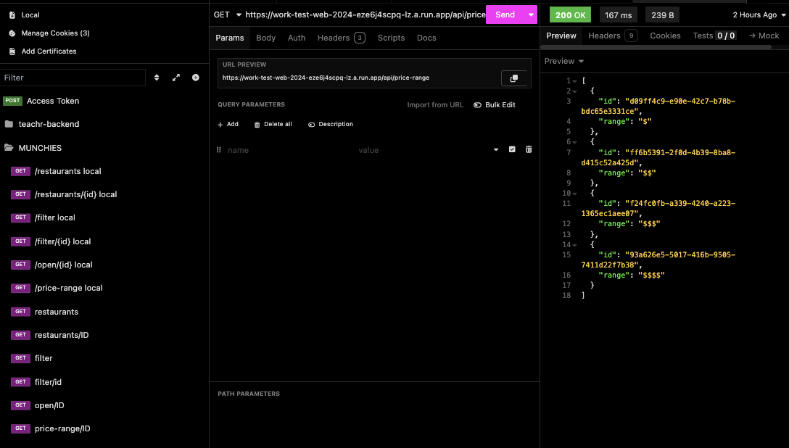

This is a [Next.js](https://nextjs.org) project bootstrapped with [`create-next-app`](https://nextjs.org/docs/app/api-reference/cli/create-next-app).

## Getting Started with Munchies after cloning repository from GitHub

First, install the dependencies:

```bash
npm i
```

Then run the development server:

```bash
npm run dev
```

Finally, open [http://localhost:3000](http://localhost:3000) with your browser to see the result.


## Final Thoughts
- Need to configure images for Next.js
- Continue styling and adding web accessibility to front-end
- Remove


## Backend Development Progress
Created an Inomnia folder for each call for external and proxy call to assure they matched


## Frontend Development Progress
Focused on creating a basic architecture for the page above else. Need more time to add error handling for each API call. Also, need to add 'open' and 'price-range' data to Filter component. Decided to deprioritize adding images over architecture as the layout is more of a challenge than images.
